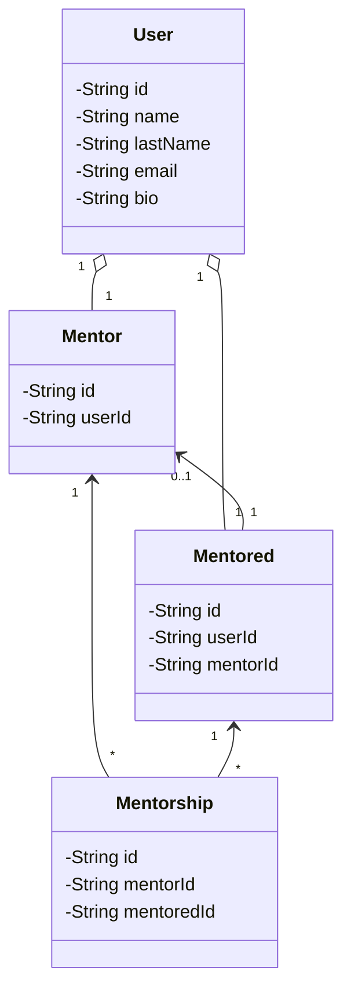

# Mintsu's Architecture

## Domain, our entities
First things first, let's talk about the entities / classes from our application.

- **User**: entity responsible to hold information about the logged user;
- **Mentor**: entity responsible to hold information about an user who wants to mentor another developers;
- **Mentored**: entity responsible to hold information about an user who wants to be mentored by another developer;
- **Mentorship**: entity responsible to hold information about a mentorship between a mentor and a mentored.

