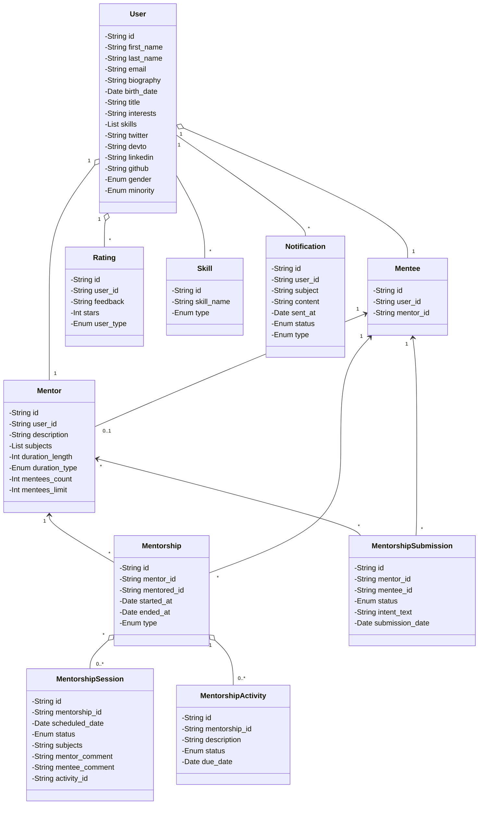

# Meent's Architecture

## Domain, our entities
First things first, let's talk about the entities / classes from our application.

- **User**: entity responsible to hold information about the logged user;
- **Mentor**: entity responsible to hold information about a user who wants to mentor another developers;
- **Mentee**: entity responsible to hold information about a user who wants to be mentored by another developer;
- **Mentorship**: entity responsible to hold information about a mentorship between a mentor and a mentee;
- **MentorshipSession**: entity responsible to hold information about a specific session from a mentorship;
- **MentorshipActivities**: entity responsible to hold activities from a mentorship session between the mentee and 
- mentor;
- **MentorshipSubmission**: entity responsible to hold information about a subscription from a mentee to a mentorship;
- **Rating**: entity responsible to hold mentorship ratings from mentee/mentor to each other;
- **Skill**: entity responsible to hold available skills inside the application;
- **Notification**: entity responsible to hold information about a notification that was sent to a specific user.

